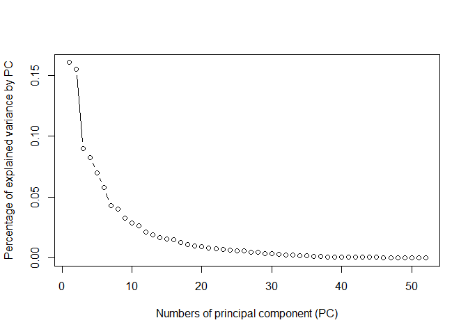
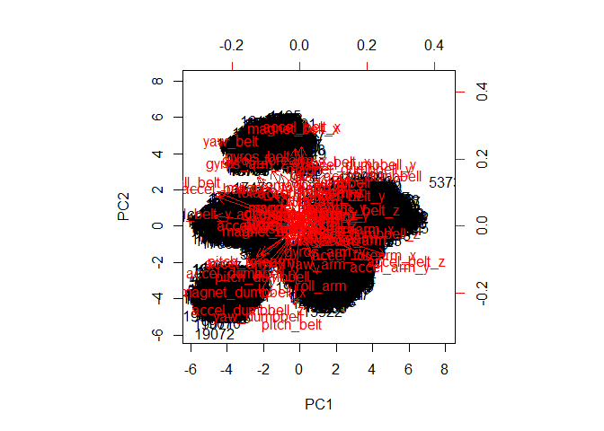
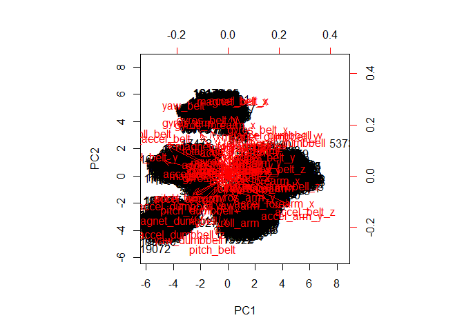
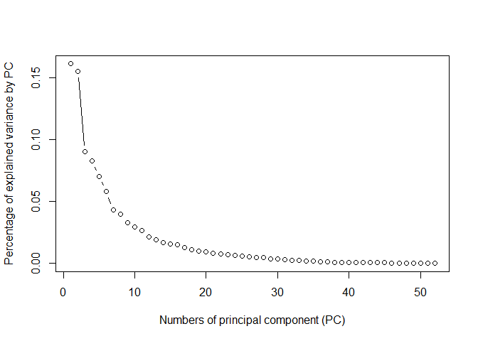
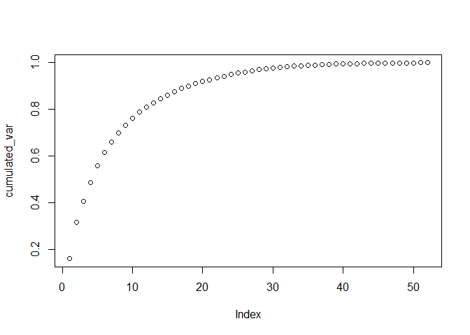
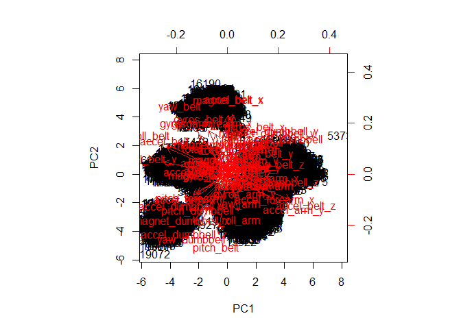
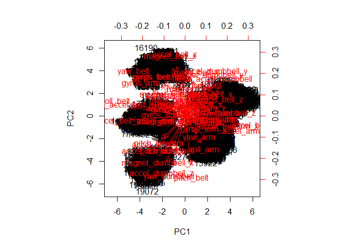
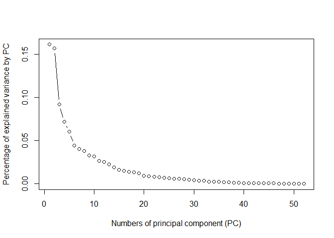
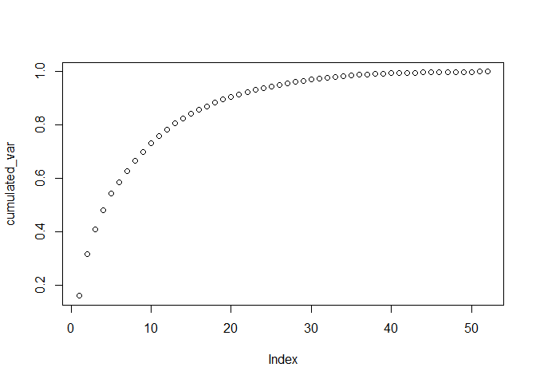

# Practical Machine Learning: Classifying how well an activity was done


```r
knitr::opts_chunk$set(cache=TRUE)
```

### Introduction to the assignment
The task in this assignment is to analyse personal activity data taken by sensors
during a weight lifting exercise in order to predict how well the exercise was
done. To create the data set 6 participants performed barbell lifts correctly 
(class A) and incorrectly with different deviations in movement (classes B-F). 
The data comes from accelerometers on the belt, forearm and arm of all participants
as well as from the dumbbell. Further information can be found here:
http://groupware.les.inf.puc-rio.br/har

### Loading the data
To start the analyis, the training data is loaded:

```r
library(lubridate)

if (!file.exists("pml-training.csv")){
        download.file("https://d396qusza40orc.cloudfront.net/predmachlearn/pml-training.csv", 
                      "pml-training.csv")
        print(now())
  }
```

```
## [1] "2017-05-05 19:36:31 CEST"
```

```r
training_data<-read.csv("pml-training.csv", header=TRUE)
```

It has the following dimensions:

```r
dim(training_data)
```

```
## [1] 19622   160
```

For later use the testing data is also loaded:

```r
if (!file.exists("pml-testing.csv")){
        download.file("https://d396qusza40orc.cloudfront.net/predmachlearn/pml-testing.csv", 
                      "pml-testing.csv")
        print(now())
  }
```

```
## [1] "2017-05-05 19:36:33 CEST"
```

```r
testing_data<-read.csv("pml-testing.csv", header=TRUE)
```

We will not be looking at the data until the analysis is finished. 

### Separation of training data in training and validation data
In this assignment I use random sampling as cross validation, since I want to include
activitiy data of all of the participants in the training set which would not 
necessarily be the case in using k-fold. For each run 75% of the (training) data 
will be used for training, the other 25% will be used for validation. The classification
of the activity is stored in the "classe" variable.


```r
library(caret)
set.seed(334)
inTrain<-createDataPartition(y=training_data$classe, p=0.75, list=FALSE)
training<-training_data[inTrain,]
validate<-training_data[-inTrain,]
```

### Exploration of the training data
According to the assignment any of the variables of the data set can be used for
the prediction of the classe variable. Before predicting, let's have a first look 
at the training data.


```r
str(training)
```

```
## 'data.frame':	14718 obs. of  160 variables:
##  $ X                       : int  1 5 6 7 8 9 10 11 12 14 ...
##  $ user_name               : Factor w/ 6 levels "adelmo","carlitos",..: 2 2 2 2 2 2 2 2 2 2 ...
##  $ raw_timestamp_part_1    : int  1323084231 1323084232 1323084232 1323084232 1323084232 1323084232 1323084232 1323084232 1323084232 1323084232 ...
##  $ raw_timestamp_part_2    : int  788290 196328 304277 368296 440390 484323 484434 500302 528316 576390 ...
##  $ cvtd_timestamp          : Factor w/ 20 levels "02/12/2011 13:32",..: 9 9 9 9 9 9 9 9 9 9 ...
##  $ new_window              : Factor w/ 2 levels "no","yes": 1 1 1 1 1 1 1 1 1 1 ...
##  $ num_window              : int  11 12 12 12 12 12 12 12 12 12 ...
##  $ roll_belt               : num  1.41 1.48 1.45 1.42 1.42 1.43 1.45 1.45 1.43 1.42 ...
##  $ pitch_belt              : num  8.07 8.07 8.06 8.09 8.13 8.16 8.17 8.18 8.18 8.21 ...
##  $ yaw_belt                : num  -94.4 -94.4 -94.4 -94.4 -94.4 -94.4 -94.4 -94.4 -94.4 -94.4 ...
##  $ total_accel_belt        : int  3 3 3 3 3 3 3 3 3 3 ...
##  $ kurtosis_roll_belt      : Factor w/ 397 levels "","-0.016850",..: 1 1 1 1 1 1 1 1 1 1 ...
##  $ kurtosis_picth_belt     : Factor w/ 317 levels "","-0.021887",..: 1 1 1 1 1 1 1 1 1 1 ...
##  $ kurtosis_yaw_belt       : Factor w/ 2 levels "","#DIV/0!": 1 1 1 1 1 1 1 1 1 1 ...
##  $ skewness_roll_belt      : Factor w/ 395 levels "","-0.003095",..: 1 1 1 1 1 1 1 1 1 1 ...
##  $ skewness_roll_belt.1    : Factor w/ 338 levels "","-0.005928",..: 1 1 1 1 1 1 1 1 1 1 ...
##  $ skewness_yaw_belt       : Factor w/ 2 levels "","#DIV/0!": 1 1 1 1 1 1 1 1 1 1 ...
##  $ max_roll_belt           : num  NA NA NA NA NA NA NA NA NA NA ...
##  $ max_picth_belt          : int  NA NA NA NA NA NA NA NA NA NA ...
##  $ max_yaw_belt            : Factor w/ 68 levels "","-0.1","-0.2",..: 1 1 1 1 1 1 1 1 1 1 ...
##  $ min_roll_belt           : num  NA NA NA NA NA NA NA NA NA NA ...
##  $ min_pitch_belt          : int  NA NA NA NA NA NA NA NA NA NA ...
##  $ min_yaw_belt            : Factor w/ 68 levels "","-0.1","-0.2",..: 1 1 1 1 1 1 1 1 1 1 ...
##  $ amplitude_roll_belt     : num  NA NA NA NA NA NA NA NA NA NA ...
##  $ amplitude_pitch_belt    : int  NA NA NA NA NA NA NA NA NA NA ...
##  $ amplitude_yaw_belt      : Factor w/ 4 levels "","#DIV/0!","0.00",..: 1 1 1 1 1 1 1 1 1 1 ...
##  $ var_total_accel_belt    : num  NA NA NA NA NA NA NA NA NA NA ...
##  $ avg_roll_belt           : num  NA NA NA NA NA NA NA NA NA NA ...
##  $ stddev_roll_belt        : num  NA NA NA NA NA NA NA NA NA NA ...
##  $ var_roll_belt           : num  NA NA NA NA NA NA NA NA NA NA ...
##  $ avg_pitch_belt          : num  NA NA NA NA NA NA NA NA NA NA ...
##  $ stddev_pitch_belt       : num  NA NA NA NA NA NA NA NA NA NA ...
##  $ var_pitch_belt          : num  NA NA NA NA NA NA NA NA NA NA ...
##  $ avg_yaw_belt            : num  NA NA NA NA NA NA NA NA NA NA ...
##  $ stddev_yaw_belt         : num  NA NA NA NA NA NA NA NA NA NA ...
##  $ var_yaw_belt            : num  NA NA NA NA NA NA NA NA NA NA ...
##  $ gyros_belt_x            : num  0 0.02 0.02 0.02 0.02 0.02 0.03 0.03 0.02 0.02 ...
##  $ gyros_belt_y            : num  0 0.02 0 0 0 0 0 0 0 0 ...
##  $ gyros_belt_z            : num  -0.02 -0.02 -0.02 -0.02 -0.02 -0.02 0 -0.02 -0.02 -0.02 ...
##  $ accel_belt_x            : int  -21 -21 -21 -22 -22 -20 -21 -21 -22 -22 ...
##  $ accel_belt_y            : int  4 2 4 3 4 2 4 2 2 4 ...
##  $ accel_belt_z            : int  22 24 21 21 21 24 22 23 23 21 ...
##  $ magnet_belt_x           : int  -3 -6 0 -4 -2 1 -3 -5 -2 -8 ...
##  $ magnet_belt_y           : int  599 600 603 599 603 602 609 596 602 598 ...
##  $ magnet_belt_z           : int  -313 -302 -312 -311 -313 -312 -308 -317 -319 -310 ...
##  $ roll_arm                : num  -128 -128 -128 -128 -128 -128 -128 -128 -128 -128 ...
##  $ pitch_arm               : num  22.5 22.1 22 21.9 21.8 21.7 21.6 21.5 21.5 21.4 ...
##  $ yaw_arm                 : num  -161 -161 -161 -161 -161 -161 -161 -161 -161 -161 ...
##  $ total_accel_arm         : int  34 34 34 34 34 34 34 34 34 34 ...
##  $ var_accel_arm           : num  NA NA NA NA NA NA NA NA NA NA ...
##  $ avg_roll_arm            : num  NA NA NA NA NA NA NA NA NA NA ...
##  $ stddev_roll_arm         : num  NA NA NA NA NA NA NA NA NA NA ...
##  $ var_roll_arm            : num  NA NA NA NA NA NA NA NA NA NA ...
##  $ avg_pitch_arm           : num  NA NA NA NA NA NA NA NA NA NA ...
##  $ stddev_pitch_arm        : num  NA NA NA NA NA NA NA NA NA NA ...
##  $ var_pitch_arm           : num  NA NA NA NA NA NA NA NA NA NA ...
##  $ avg_yaw_arm             : num  NA NA NA NA NA NA NA NA NA NA ...
##  $ stddev_yaw_arm          : num  NA NA NA NA NA NA NA NA NA NA ...
##  $ var_yaw_arm             : num  NA NA NA NA NA NA NA NA NA NA ...
##  $ gyros_arm_x             : num  0 0 0.02 0 0.02 0.02 0.02 0.02 0.02 0.02 ...
##  $ gyros_arm_y             : num  0 -0.03 -0.03 -0.03 -0.02 -0.03 -0.03 -0.03 -0.03 0 ...
##  $ gyros_arm_z             : num  -0.02 0 0 0 0 -0.02 -0.02 0 0 -0.03 ...
##  $ accel_arm_x             : int  -288 -289 -289 -289 -289 -288 -288 -290 -288 -288 ...
##  $ accel_arm_y             : int  109 111 111 111 111 109 110 110 111 111 ...
##  $ accel_arm_z             : int  -123 -123 -122 -125 -124 -122 -124 -123 -123 -124 ...
##  $ magnet_arm_x            : int  -368 -374 -369 -373 -372 -369 -376 -366 -363 -371 ...
##  $ magnet_arm_y            : int  337 337 342 336 338 341 334 339 343 331 ...
##  $ magnet_arm_z            : int  516 506 513 509 510 518 516 509 520 523 ...
##  $ kurtosis_roll_arm       : Factor w/ 330 levels "","-0.02438",..: 1 1 1 1 1 1 1 1 1 1 ...
##  $ kurtosis_picth_arm      : Factor w/ 328 levels "","-0.00484",..: 1 1 1 1 1 1 1 1 1 1 ...
##  $ kurtosis_yaw_arm        : Factor w/ 395 levels "","-0.01548",..: 1 1 1 1 1 1 1 1 1 1 ...
##  $ skewness_roll_arm       : Factor w/ 331 levels "","-0.00051",..: 1 1 1 1 1 1 1 1 1 1 ...
##  $ skewness_pitch_arm      : Factor w/ 328 levels "","-0.00184",..: 1 1 1 1 1 1 1 1 1 1 ...
##  $ skewness_yaw_arm        : Factor w/ 395 levels "","-0.00311",..: 1 1 1 1 1 1 1 1 1 1 ...
##  $ max_roll_arm            : num  NA NA NA NA NA NA NA NA NA NA ...
##  $ max_picth_arm           : num  NA NA NA NA NA NA NA NA NA NA ...
##  $ max_yaw_arm             : int  NA NA NA NA NA NA NA NA NA NA ...
##  $ min_roll_arm            : num  NA NA NA NA NA NA NA NA NA NA ...
##  $ min_pitch_arm           : num  NA NA NA NA NA NA NA NA NA NA ...
##  $ min_yaw_arm             : int  NA NA NA NA NA NA NA NA NA NA ...
##  $ amplitude_roll_arm      : num  NA NA NA NA NA NA NA NA NA NA ...
##  $ amplitude_pitch_arm     : num  NA NA NA NA NA NA NA NA NA NA ...
##  $ amplitude_yaw_arm       : int  NA NA NA NA NA NA NA NA NA NA ...
##  $ roll_dumbbell           : num  13.1 13.4 13.4 13.1 12.8 ...
##  $ pitch_dumbbell          : num  -70.5 -70.4 -70.8 -70.2 -70.3 ...
##  $ yaw_dumbbell            : num  -84.9 -84.9 -84.5 -85.1 -85.1 ...
##  $ kurtosis_roll_dumbbell  : Factor w/ 398 levels "","-0.0035","-0.0073",..: 1 1 1 1 1 1 1 1 1 1 ...
##  $ kurtosis_picth_dumbbell : Factor w/ 401 levels "","-0.0163","-0.0233",..: 1 1 1 1 1 1 1 1 1 1 ...
##  $ kurtosis_yaw_dumbbell   : Factor w/ 2 levels "","#DIV/0!": 1 1 1 1 1 1 1 1 1 1 ...
##  $ skewness_roll_dumbbell  : Factor w/ 401 levels "","-0.0082","-0.0096",..: 1 1 1 1 1 1 1 1 1 1 ...
##  $ skewness_pitch_dumbbell : Factor w/ 402 levels "","-0.0053","-0.0084",..: 1 1 1 1 1 1 1 1 1 1 ...
##  $ skewness_yaw_dumbbell   : Factor w/ 2 levels "","#DIV/0!": 1 1 1 1 1 1 1 1 1 1 ...
##  $ max_roll_dumbbell       : num  NA NA NA NA NA NA NA NA NA NA ...
##  $ max_picth_dumbbell      : num  NA NA NA NA NA NA NA NA NA NA ...
##  $ max_yaw_dumbbell        : Factor w/ 73 levels "","-0.1","-0.2",..: 1 1 1 1 1 1 1 1 1 1 ...
##  $ min_roll_dumbbell       : num  NA NA NA NA NA NA NA NA NA NA ...
##  $ min_pitch_dumbbell      : num  NA NA NA NA NA NA NA NA NA NA ...
##  $ min_yaw_dumbbell        : Factor w/ 73 levels "","-0.1","-0.2",..: 1 1 1 1 1 1 1 1 1 1 ...
##  $ amplitude_roll_dumbbell : num  NA NA NA NA NA NA NA NA NA NA ...
##   [list output truncated]
```

As can be seen on the first view, the data set contains factor, integer and numeric
variables and a lot of NAs. 

Let's first have a look at the NAs. Calculation of the percentage of NA per variable

```r
percentageNA<-apply(is.na(training),2,sum)/dim(training)[1]
```

and for better readability presention of the result as a table

```r
table(percentageNA)
```

```
## percentageNA
##                 0 0.980160347873352 
##                93                67
```

As we can see from this, 67 variables contain (almost) no information at all and
can be left out for further analysis of the data set. Therefore we can reduce
the training data:

```r
training_red<-training[percentageNA<0.1]
```

In the resulting data set there seem to be a certain number of variables that 
mostly contain the value "". Let's have a look at this:

```r
percentageEmpty<-apply(training_red=="",2,sum)/dim(training)[1]
table(percentageEmpty)
```

```
## percentageEmpty
##                 0 0.980160347873352 
##                60                33
```

As we see, another 33 variables can be left out:

```r
training_red2<-training_red[percentageEmpty<0.1]
```

Now, except of the "administrative" columns 1 to 7 we only have integer or numeric
columns. Since we want our model to learn from sensor data and not from 
"administrative" data that has no information for later prediction, we additionally 
reduce the data set by leaving out the administrative columns.

```r
training_red3<-training_red2[8:60]
```

Now, we only have 53 instead of 160 columns left:

```r
dim(training_red3)
```

```
## [1] 14718    53
```

This preprocessing is now done for the whole set of the training data as 
well as for the testing data:

```r
training_data_red<-training_data[percentageNA<0.1]
training_data_red2<-training_data_red[percentageEmpty<0.1]
data_train<-training_data_red2[8:60]

testing_data_red<-testing_data[percentageNA<0.1]
testing_data_red2<-testing_data_red[percentageEmpty<0.1]
data_test<-testing_data_red2[8:60]
```

Note: a similar result (except of for the administrative columns) will also be given by nearZeroVars.

### Choosing the relevant predictors and adequate method using cross validation

At first we quickly prepare the data sets we need for training and validating.

```r
# no contains the numbers for the seed to be used
no<-c(334,2465,126,8832,45)

# for all 5 iterations the training and validate data sets are created and stored for later usage
set.seed(no[1])
inTrain<-createDataPartition(y=data_train$classe, p=0.75, list=FALSE)
training1<-data_train[inTrain,]
validate1<-data_train[-inTrain,]

set.seed(no[2])
inTrain<-createDataPartition(y=data_train$classe, p=0.75, list=FALSE)
training2<-data_train[inTrain,]
validate2<-data_train[-inTrain,]

set.seed(no[3])
inTrain<-createDataPartition(y=data_train$classe, p=0.75, list=FALSE)
training3<-data_train[inTrain,]
validate3<-data_train[-inTrain,]

set.seed(no[4])
inTrain<-createDataPartition(y=data_train$classe, p=0.75, list=FALSE)
training4<-data_train[inTrain,]
validate4<-data_train[-inTrain,]

set.seed(no[5])
inTrain<-createDataPartition(y=data_train$classe, p=0.75, list=FALSE)
training5<-data_train[inTrain,]
validate5<-data_train[-inTrain,]
```


#### Principal components analysis

Now we have a look at the principal components of the data set.

```r
library(stats)

for (i in 1:5){
        
        # choice of correct training data set
        if (i==1) {training<-training1} else {
                if (i==2) {training<-training2} else {
                        if (i==3) {training<-training3} else {
                                if (i==4) {training<-training4} else {
                                        training<-training5
                                }
                        }
                }
        }
        
        # calculation of PCA
        training_pca <- prcomp(training[,1:52], scale = TRUE)
        #plot(training_pca)
        biplot(training_pca,scale=0)

        # percentage of explained variance
        percent_var <- training_pca$sdev^2/sum(training_pca$sdev^2)

        # Screeplot
        plot(percent_var, type="b", xlab = "Numbers of principal component (PC)",
             ylab = "Percentage of explained variance by PC")

        # cumulated variance
        cumulated_var <- cumsum(training_pca$sdev^2)/sum(training_pca$sdev^2)
        plot(cumulated_var)
        
        # create training set from classe variable and principal components for later use
        if (i==1) {training_pca1<-training_pca} else {
                if (i==2) {training_pca2<-training_pca} else {
                        if (i==3) {training_pca3<-training_pca} else {
                                if (i==4) {training_pca4<-training_pca} else {
                                        training_pca5<-training_pca
                                }
                        }
                }
        }
}
```

<!-- --><!-- --><!-- --><!-- --><!-- --><!-- --><!-- --><!-- --><!-- --><!-- --><!-- --><!-- --><!-- --><!-- --><!-- -->

In the following the methods rf and rpart are compared each using 18 or 6 principal components. 18 components since they explain about 90% of the variance, 6 components since there is a change in the scree plot. It might be possible to combine the two methods with 6 components to receive good results but before deciding on testing that, let's have look at the results for these 4 variants. For each variant 5 iterations are done.

#### Random forest with 18 principal components

```r
# initialization of variable for storing accuracy of method
acc_rf18<-numeric()

for (i in 1:5){

        # choice of correct pca, training and validation data sets
        if (i==1) {training_pca<-training_pca1; training<-training1; validate<-validate1} else {
                if (i==2) {training_pca<-training_pca2; training<-training2; validate<-validate2} else {
                        if (i==3) {training_pca<-training_pca3; training<-training3; validate<-validate3} else {
                                if (i==4) {training_pca<-training_pca4; training<-training4; validate<-validate4} else {
                                        training_pca<-training_pca5; training<-training5; validate<-validate5
                                }
                        }
                }
        }

        # create training set from classe variable and principal components
        train_pca<-data.frame(classe = training$classe, training_pca$x)

        # in this case we use the classe variable and 18 PCs
        train_pca <- train_pca[,1:19]

        # training of random forest model
        modFit <- train(classe ~ .,data = train_pca, method = "rf")
        print(modFit)

        # before actual prediction, validation data needs to be transformed according to principle
        # components from training data

        test <- predict(training_pca, newdata = validate)
        print(str(test))
        test <- as.data.frame(test)

        # in this case we use 18 PCs (see above), the test data has no classe variable
        test <- test[,1:18]

        # prediction of the classe variable from the test data with the calculated model from above
        pred <- predict(modFit, test)
        print(table(validate$classe,pred))
        
        # calculate and store accuracy for later use
        acc_rf18<-rbind(acc_rf18,sum(validate$classe==pred)/length(pred))
}
```

```
## Random Forest 
## 
## 14718 samples
##    18 predictor
##     5 classes: 'A', 'B', 'C', 'D', 'E' 
## 
## No pre-processing
## Resampling: Bootstrapped (25 reps) 
## Summary of sample sizes: 14718, 14718, 14718, 14718, 14718, 14718, ... 
## Resampling results across tuning parameters:
## 
##   mtry  Accuracy   Kappa    
##    2    0.9617863  0.9516425
##   10    0.9547626  0.9427613
##   18    0.9446060  0.9299099
## 
## Accuracy was used to select the optimal model using  the largest value.
## The final value used for the model was mtry = 2.
##  num [1:4904, 1:52] 4.42 4.39 4.4 4.43 4.41 ...
##  - attr(*, "dimnames")=List of 2
##   ..$ : chr [1:4904] "2" "3" "4" "13" ...
##   ..$ : chr [1:52] "PC1" "PC2" "PC3" "PC4" ...
## NULL
##    pred
##        A    B    C    D    E
##   A 1375    5   11    3    1
##   B   12  912   22    3    0
##   C    2   16  830    6    1
##   D    4    0   38  759    3
##   E    2    3    4    8  884
## Random Forest 
## 
## 14718 samples
##    18 predictor
##     5 classes: 'A', 'B', 'C', 'D', 'E' 
## 
## No pre-processing
## Resampling: Bootstrapped (25 reps) 
## Summary of sample sizes: 14718, 14718, 14718, 14718, 14718, 14718, ... 
## Resampling results across tuning parameters:
## 
##   mtry  Accuracy   Kappa    
##    2    0.9607264  0.9502965
##   10    0.9531435  0.9407076
##   18    0.9448955  0.9302720
## 
## Accuracy was used to select the optimal model using  the largest value.
## The final value used for the model was mtry = 2.
##  num [1:4904, 1:52] 4.36 4.33 4.34 4.34 4.36 ...
##  - attr(*, "dimnames")=List of 2
##   ..$ : chr [1:4904] "2" "3" "4" "6" ...
##   ..$ : chr [1:52] "PC1" "PC2" "PC3" "PC4" ...
## NULL
##    pred
##        A    B    C    D    E
##   A 1381    5    8    0    1
##   B   16  920   13    0    0
##   C    1   18  826    7    3
##   D    3    1   21  777    2
##   E    0    2    6    4  889
## Random Forest 
## 
## 14718 samples
##    18 predictor
##     5 classes: 'A', 'B', 'C', 'D', 'E' 
## 
## No pre-processing
## Resampling: Bootstrapped (25 reps) 
## Summary of sample sizes: 14718, 14718, 14718, 14718, 14718, 14718, ... 
## Resampling results across tuning parameters:
## 
##   mtry  Accuracy   Kappa    
##    2    0.9597070  0.9490001
##   10    0.9518520  0.9390647
##   18    0.9399514  0.9240050
## 
## Accuracy was used to select the optimal model using  the largest value.
## The final value used for the model was mtry = 2.
##  num [1:4904, 1:52] 4.53 4.5 4.49 4.52 4.5 ...
##  - attr(*, "dimnames")=List of 2
##   ..$ : chr [1:4904] "2" "3" "7" "9" ...
##   ..$ : chr [1:52] "PC1" "PC2" "PC3" "PC4" ...
## NULL
##    pred
##        A    B    C    D    E
##   A 1380    6    2    6    1
##   B   20  922    7    0    0
##   C    1   12  833    8    1
##   D    0    1   30  768    5
##   E    0    4    6    6  885
## Random Forest 
## 
## 14718 samples
##    18 predictor
##     5 classes: 'A', 'B', 'C', 'D', 'E' 
## 
## No pre-processing
## Resampling: Bootstrapped (25 reps) 
## Summary of sample sizes: 14718, 14718, 14718, 14718, 14718, 14718, ... 
## Resampling results across tuning parameters:
## 
##   mtry  Accuracy   Kappa    
##    2    0.9608543  0.9504669
##   10    0.9534372  0.9410818
##   18    0.9445121  0.9297899
## 
## Accuracy was used to select the optimal model using  the largest value.
## The final value used for the model was mtry = 2.
##  num [1:4904, 1:52] 4.44 4.48 4.48 4.47 4.39 ...
##  - attr(*, "dimnames")=List of 2
##   ..$ : chr [1:4904] "1" "2" "9" "11" ...
##   ..$ : chr [1:52] "PC1" "PC2" "PC3" "PC4" ...
## NULL
##    pred
##        A    B    C    D    E
##   A 1383    2    9    1    0
##   B   15  918   12    1    3
##   C    1   11  832    9    2
##   D    3    1   31  766    3
##   E    1    2    3    9  886
## Random Forest 
## 
## 14718 samples
##    18 predictor
##     5 classes: 'A', 'B', 'C', 'D', 'E' 
## 
## No pre-processing
## Resampling: Bootstrapped (25 reps) 
## Summary of sample sizes: 14718, 14718, 14718, 14718, 14718, 14718, ... 
## Resampling results across tuning parameters:
## 
##   mtry  Accuracy   Kappa    
##    2    0.9629795  0.9531477
##   10    0.9572661  0.9459143
##   18    0.9442797  0.9294798
## 
## Accuracy was used to select the optimal model using  the largest value.
## The final value used for the model was mtry = 2.
##  num [1:4904, 1:52] 4 3.99 4 4.04 4.04 ...
##  - attr(*, "dimnames")=List of 2
##   ..$ : chr [1:4904] "3" "5" "6" "10" ...
##   ..$ : chr [1:52] "PC1" "PC2" "PC3" "PC4" ...
## NULL
##    pred
##        A    B    C    D    E
##   A 1377   11    5    1    1
##   B   10  925   13    0    1
##   C    2    6  835   10    2
##   D    5    2   33  761    3
##   E    0    3    8    3  887
```

```r
print(acc_rf18)
```

```
##           [,1]
## [1,] 0.9706362
## [2,] 0.9773654
## [3,] 0.9763458
## [4,] 0.9757341
## [5,] 0.9757341
```

#### Random forest with 6 principal components

```r
# initialization of variable for storing accuracy of method
acc_rf6<-numeric()

for (i in 1:5){

        # choice of correct pca, training and validation data sets
        if (i==1) {training_pca<-training_pca1; training<-training1; validate<-validate1} else {
                if (i==2) {training_pca<-training_pca2; training<-training2; validate<-validate2} else {
                        if (i==3) {training_pca<-training_pca3; training<-training3; validate<-validate3} else {
                                if (i==4) {training_pca<-training_pca4; training<-training4; validate<-validate4} else {
                                        training_pca<-training_pca5; training<-training5; validate<-validate5
                                }
                        }
                }
        }

        # create training set from classe variable and principal components
        train_pca<-data.frame(classe = training$classe, training_pca$x)

        # in this case we use the classe variable and 6 PCs
        train_pca <- train_pca[,1:7]

        # training of random forest model
        modFit <- train(classe ~ .,data = train_pca, method = "rf")
        print(modFit)

        # before actual prediction, validation data needs to be transformed according to principle
        # components from training data

        test <- predict(training_pca, newdata = validate)
        print(str(test))
        test <- as.data.frame(test)

        # in this case we use 6 PCs (see above), the test data has no classe variable
        test <- test[,1:6]

        # prediction of the classe variable from the test data with the calculated model from above
        pred <- predict(modFit, test)
        print(table(validate$classe,pred))
        
        # calculate and store accuracy for later use
        acc_rf6<-rbind(acc_rf6,sum(validate$classe==pred)/length(pred))
}
```

```
## Random Forest 
## 
## 14718 samples
##     6 predictor
##     5 classes: 'A', 'B', 'C', 'D', 'E' 
## 
## No pre-processing
## Resampling: Bootstrapped (25 reps) 
## Summary of sample sizes: 14718, 14718, 14718, 14718, 14718, 14718, ... 
## Resampling results across tuning parameters:
## 
##   mtry  Accuracy   Kappa    
##   2     0.8701574  0.8356465
##   4     0.8595810  0.8222535
##   6     0.8460731  0.8051563
## 
## Accuracy was used to select the optimal model using  the largest value.
## The final value used for the model was mtry = 2.
##  num [1:4904, 1:52] 4.42 4.39 4.4 4.43 4.41 ...
##  - attr(*, "dimnames")=List of 2
##   ..$ : chr [1:4904] "2" "3" "4" "13" ...
##   ..$ : chr [1:52] "PC1" "PC2" "PC3" "PC4" ...
## NULL
##    pred
##        A    B    C    D    E
##   A 1303   16   40   29    7
##   B   37  800   50   28   34
##   C   28   36  740   39   12
##   D   28   18   54  693   11
##   E   22   26   16   23  814
## Random Forest 
## 
## 14718 samples
##     6 predictor
##     5 classes: 'A', 'B', 'C', 'D', 'E' 
## 
## No pre-processing
## Resampling: Bootstrapped (25 reps) 
## Summary of sample sizes: 14718, 14718, 14718, 14718, 14718, 14718, ... 
## Resampling results across tuning parameters:
## 
##   mtry  Accuracy   Kappa    
##   2     0.8664783  0.8311441
##   4     0.8571334  0.8193405
##   6     0.8438746  0.8025816
## 
## Accuracy was used to select the optimal model using  the largest value.
## The final value used for the model was mtry = 2.
##  num [1:4904, 1:52] 4.36 4.33 4.34 4.34 4.36 ...
##  - attr(*, "dimnames")=List of 2
##   ..$ : chr [1:4904] "2" "3" "4" "6" ...
##   ..$ : chr [1:52] "PC1" "PC2" "PC3" "PC4" ...
## NULL
##    pred
##        A    B    C    D    E
##   A 1322   13   31   18   11
##   B   33  840   34   20   22
##   C   33   46  734   27   15
##   D   27   13   50  705    9
##   E   21   28   19   20  813
## Random Forest 
## 
## 14718 samples
##     6 predictor
##     5 classes: 'A', 'B', 'C', 'D', 'E' 
## 
## No pre-processing
## Resampling: Bootstrapped (25 reps) 
## Summary of sample sizes: 14718, 14718, 14718, 14718, 14718, 14718, ... 
## Resampling results across tuning parameters:
## 
##   mtry  Accuracy   Kappa    
##   2     0.8647262  0.8288754
##   4     0.8556407  0.8173814
##   6     0.8445205  0.8033359
## 
## Accuracy was used to select the optimal model using  the largest value.
## The final value used for the model was mtry = 2.
##  num [1:4904, 1:52] 4.53 4.5 4.49 4.52 4.5 ...
##  - attr(*, "dimnames")=List of 2
##   ..$ : chr [1:4904] "2" "3" "7" "9" ...
##   ..$ : chr [1:52] "PC1" "PC2" "PC3" "PC4" ...
## NULL
##    pred
##        A    B    C    D    E
##   A 1301   16   37   26   15
##   B   51  821   39   24   14
##   C   19   27  760   30   19
##   D   21   15   59  702    7
##   E   15   19   20   19  828
## Random Forest 
## 
## 14718 samples
##     6 predictor
##     5 classes: 'A', 'B', 'C', 'D', 'E' 
## 
## No pre-processing
## Resampling: Bootstrapped (25 reps) 
## Summary of sample sizes: 14718, 14718, 14718, 14718, 14718, 14718, ... 
## Resampling results across tuning parameters:
## 
##   mtry  Accuracy   Kappa    
##   2     0.8676782  0.8325243
##   4     0.8587011  0.8211555
##   6     0.8453573  0.8042769
## 
## Accuracy was used to select the optimal model using  the largest value.
## The final value used for the model was mtry = 2.
##  num [1:4904, 1:52] 4.44 4.48 4.48 4.47 4.39 ...
##  - attr(*, "dimnames")=List of 2
##   ..$ : chr [1:4904] "1" "2" "9" "11" ...
##   ..$ : chr [1:52] "PC1" "PC2" "PC3" "PC4" ...
## NULL
##    pred
##        A    B    C    D    E
##   A 1286   31   42   24   12
##   B   34  837   36   20   22
##   C   26   35  748   30   16
##   D   15   12   58  706   13
##   E   19   25   12   29  816
## Random Forest 
## 
## 14718 samples
##     6 predictor
##     5 classes: 'A', 'B', 'C', 'D', 'E' 
## 
## No pre-processing
## Resampling: Bootstrapped (25 reps) 
## Summary of sample sizes: 14718, 14718, 14718, 14718, 14718, 14718, ... 
## Resampling results across tuning parameters:
## 
##   mtry  Accuracy   Kappa    
##   2     0.8527758  0.8136655
##   4     0.8446636  0.8033864
##   6     0.8308741  0.7859362
## 
## Accuracy was used to select the optimal model using  the largest value.
## The final value used for the model was mtry = 2.
##  num [1:4904, 1:52] 4 3.99 4 4.04 4.04 ...
##  - attr(*, "dimnames")=List of 2
##   ..$ : chr [1:4904] "3" "5" "6" "10" ...
##   ..$ : chr [1:52] "PC1" "PC2" "PC3" "PC4" ...
## NULL
##    pred
##        A    B    C    D    E
##   A 1281   26   45   30   13
##   B   50  823   48   13   15
##   C   27   56  737   29    6
##   D   26   14   52  696   16
##   E   12   26   20   32  811
```

```r
print(acc_rf6)
```

```
##           [,1]
## [1,] 0.8870310
## [2,] 0.9000816
## [3,] 0.8996737
## [4,] 0.8957993
## [5,] 0.8866232
```


#### rpart with 18 principal components

```r
# initialization of variable for storing accuracy of method
acc_rpart18<-numeric()

for (i in 1:5){

        # choice of correct pca, training and validation data sets
        if (i==1) {training_pca<-training_pca1; training<-training1; validate<-validate1} else {
                if (i==2) {training_pca<-training_pca2; training<-training2; validate<-validate2} else {
                        if (i==3) {training_pca<-training_pca3; training<-training3; validate<-validate3} else {
                                if (i==4) {training_pca<-training_pca4; training<-training4; validate<-validate4} else {
                                        training_pca<-training_pca5; training<-training5; validate<-validate5
                                }
                        }
                }
        }

        # create training set from classe variable and principal components
        train_pca<-data.frame(classe = training$classe, training_pca$x)

        # in this case we use the classe variable and 18 PCs
        train_pca <- train_pca[,1:19]

        # training with rpart
        modFit <- train(classe ~ .,data = train_pca, method = "rpart")
        print(modFit)

        # before actual prediction, validation data needs to be transformed according to principle
        # components from training data

        test <- predict(training_pca, newdata = validate)
        print(str(test))
        test <- as.data.frame(test)

        # in this case we use 18 PCs (see above), the test data has no classe variable
        test <- test[,1:18]

        # prediction of the classe variable from the test data with the calculated model from above
        pred <- predict(modFit, test)
        print(table(validate$classe,pred))
        
        # calculate and store accuracy for later use
        acc_rpart18<-rbind(acc_rpart18,sum(validate$classe==pred)/length(pred))
}
```

```
## Loading required package: rpart
```

```
## CART 
## 
## 14718 samples
##    18 predictor
##     5 classes: 'A', 'B', 'C', 'D', 'E' 
## 
## No pre-processing
## Resampling: Bootstrapped (25 reps) 
## Summary of sample sizes: 14718, 14718, 14718, 14718, 14718, 14718, ... 
## Resampling results across tuning parameters:
## 
##   cp          Accuracy  Kappa     
##   0.03484287  0.389133  0.18248726
##   0.06313491  0.364465  0.13755594
##   0.07471755  0.302534  0.02810202
## 
## Accuracy was used to select the optimal model using  the largest value.
## The final value used for the model was cp = 0.03484287.
##  num [1:4904, 1:52] 4.42 4.39 4.4 4.43 4.41 ...
##  - attr(*, "dimnames")=List of 2
##   ..$ : chr [1:4904] "2" "3" "4" "13" ...
##   ..$ : chr [1:52] "PC1" "PC2" "PC3" "PC4" ...
## NULL
##    pred
##        A    B    C    D    E
##   A 1284    0    0   90   21
##   B  634    0    0  179  136
##   C  798    0    0   37   20
##   D  436    0    0  299   69
##   E  491    0    0  123  287
## CART 
## 
## 14718 samples
##    18 predictor
##     5 classes: 'A', 'B', 'C', 'D', 'E' 
## 
## No pre-processing
## Resampling: Bootstrapped (25 reps) 
## Summary of sample sizes: 14718, 14718, 14718, 14718, 14718, 14718, ... 
## Resampling results across tuning parameters:
## 
##   cp          Accuracy   Kappa     
##   0.04015950  0.3638086  0.14163383
##   0.06275515  0.3479610  0.11178483
##   0.07035033  0.3201064  0.05997454
## 
## Accuracy was used to select the optimal model using  the largest value.
## The final value used for the model was cp = 0.0401595.
##  num [1:4904, 1:52] 4.36 4.33 4.34 4.34 4.36 ...
##  - attr(*, "dimnames")=List of 2
##   ..$ : chr [1:4904] "2" "3" "4" "6" ...
##   ..$ : chr [1:52] "PC1" "PC2" "PC3" "PC4" ...
## NULL
##    pred
##        A    B    C    D    E
##   A 1282    0    0   98   15
##   B  647    0    0  191  111
##   C  805    0    0   39   11
##   D  422    0    0  324   58
##   E  518    0    0  122  261
## CART 
## 
## 14718 samples
##    18 predictor
##     5 classes: 'A', 'B', 'C', 'D', 'E' 
## 
## No pre-processing
## Resampling: Bootstrapped (25 reps) 
## Summary of sample sizes: 14718, 14718, 14718, 14718, 14718, 14718, ... 
## Resampling results across tuning parameters:
## 
##   cp          Accuracy   Kappa     
##   0.03617203  0.3867407  0.17832955
##   0.06057154  0.3623504  0.13707304
##   0.07889490  0.3121766  0.04989313
## 
## Accuracy was used to select the optimal model using  the largest value.
## The final value used for the model was cp = 0.03617203.
##  num [1:4904, 1:52] 4.53 4.5 4.49 4.52 4.5 ...
##  - attr(*, "dimnames")=List of 2
##   ..$ : chr [1:4904] "2" "3" "7" "9" ...
##   ..$ : chr [1:52] "PC1" "PC2" "PC3" "PC4" ...
## NULL
##    pred
##        A    B    C    D    E
##   A 1288    0    0   86   21
##   B  650    0    0  164  135
##   C  807    0    0   30   18
##   D  418    0    0  305   81
##   E  504    0    0  112  285
## CART 
## 
## 14718 samples
##    18 predictor
##     5 classes: 'A', 'B', 'C', 'D', 'E' 
## 
## No pre-processing
## Resampling: Bootstrapped (25 reps) 
## Summary of sample sizes: 14718, 14718, 14718, 14718, 14718, 14718, ... 
## Resampling results across tuning parameters:
## 
##   cp          Accuracy  Kappa     
##   0.03550745  0.391055  0.18431382
##   0.06190069  0.349060  0.10943703
##   0.07158454  0.309960  0.04115612
## 
## Accuracy was used to select the optimal model using  the largest value.
## The final value used for the model was cp = 0.03550745.
##  num [1:4904, 1:52] 4.44 4.48 4.48 4.47 4.39 ...
##  - attr(*, "dimnames")=List of 2
##   ..$ : chr [1:4904] "1" "2" "9" "11" ...
##   ..$ : chr [1:52] "PC1" "PC2" "PC3" "PC4" ...
## NULL
##    pred
##        A    B    C    D    E
##   A 1280    0    0   95   20
##   B  640    0    0  190  119
##   C  796    0    0   46   13
##   D  411    0    0  335   58
##   E  502    0    0  136  263
## CART 
## 
## 14718 samples
##    18 predictor
##     5 classes: 'A', 'B', 'C', 'D', 'E' 
## 
## No pre-processing
## Resampling: Bootstrapped (25 reps) 
## Summary of sample sizes: 14718, 14718, 14718, 14718, 14718, 14718, ... 
## Resampling results across tuning parameters:
## 
##   cp          Accuracy   Kappa     
##   0.03835564  0.3536412  0.13106516
##   0.04699516  0.3444969  0.11310611
##   0.06864141  0.3171807  0.05330121
## 
## Accuracy was used to select the optimal model using  the largest value.
## The final value used for the model was cp = 0.03835564.
##  num [1:4904, 1:52] 4 3.99 4 4.04 4.04 ...
##  - attr(*, "dimnames")=List of 2
##   ..$ : chr [1:4904] "3" "5" "6" "10" ...
##   ..$ : chr [1:52] "PC1" "PC2" "PC3" "PC4" ...
## NULL
##    pred
##        A    B    C    D    E
##   A 1045    0    0  348    2
##   B  471    0    0  439   39
##   C  534    0    0  318    3
##   D  266    0    0  489   49
##   E  354    0    0  314  233
```

```r
print(acc_rpart18)
```

```
##           [,1]
## [1,] 0.3813214
## [2,] 0.3807096
## [3,] 0.3829527
## [4,] 0.3829527
## [5,] 0.3603181
```

#### rpart with 6 principal components

```r
# initialization of variable for storing accuracy of method
acc_rpart6<-numeric()

for (i in 1:5){

        # choice of correct pca, training and validation data sets
        if (i==1) {training_pca<-training_pca1; training<-training1; validate<-validate1} else {
                if (i==2) {training_pca<-training_pca2; training<-training2; validate<-validate2} else {
                        if (i==3) {training_pca<-training_pca3; training<-training3; validate<-validate3} else {
                                if (i==4) {training_pca<-training_pca4; training<-training4; validate<-validate4} else {
                                        training_pca<-training_pca5; training<-training5; validate<-validate5
                                }
                        }
                }
        }

        # create training set from classe variable and principal components
        train_pca<-data.frame(classe = training$classe, training_pca$x)

        # in this case we use the classe variable and 6 PCs
        train_pca <- train_pca[,1:7]

        # training of random forest model
        modFit <- train(classe ~ .,data = train_pca, method = "rpart")
        print(modFit)

        # before actual prediction, validation data needs to be transformed according to principle
        # components from training data

        test <- predict(training_pca, newdata = validate)
        print(str(test))
        test <- as.data.frame(test)

        # in this case we use 6 PCs (see above), the test data has no classe variable
        test <- test[,1:6]

        # prediction of the classe variable from the test data with the calculated model from above
        pred <- predict(modFit, test)
        print(table(validate$classe,pred))
        
        # calculate and store accuracy for later use
        acc_rpart6<-rbind(acc_rpart6,sum(validate$classe==pred)/length(pred))
}
```

```
## CART 
## 
## 14718 samples
##     6 predictor
##     5 classes: 'A', 'B', 'C', 'D', 'E' 
## 
## No pre-processing
## Resampling: Bootstrapped (25 reps) 
## Summary of sample sizes: 14718, 14718, 14718, 14718, 14718, 14718, ... 
## Resampling results across tuning parameters:
## 
##   cp          Accuracy   Kappa     
##   0.01186746  0.3503395  0.14480438
##   0.01642457  0.3364554  0.12681037
##   0.05715371  0.3055243  0.06021612
## 
## Accuracy was used to select the optimal model using  the largest value.
## The final value used for the model was cp = 0.01186746.
##  num [1:4904, 1:52] 4.42 4.39 4.4 4.43 4.41 ...
##  - attr(*, "dimnames")=List of 2
##   ..$ : chr [1:4904] "2" "3" "4" "13" ...
##   ..$ : chr [1:52] "PC1" "PC2" "PC3" "PC4" ...
## NULL
##    pred
##        A    B    C    D    E
##   A 1096    0    0   22  277
##   B  438    0    0   62  449
##   C  553    0    0   35  267
##   D  356    0    0  152  296
##   E  382    0    0   45  474
## CART 
## 
## 14718 samples
##     6 predictor
##     5 classes: 'A', 'B', 'C', 'D', 'E' 
## 
## No pre-processing
## Resampling: Bootstrapped (25 reps) 
## Summary of sample sizes: 14718, 14718, 14718, 14718, 14718, 14718, ... 
## Resampling results across tuning parameters:
## 
##   cp          Accuracy   Kappa     
##   0.01129783  0.3664906  0.16615183
##   0.01647204  0.3359998  0.12550181
##   0.06133105  0.3030849  0.04869248
## 
## Accuracy was used to select the optimal model using  the largest value.
## The final value used for the model was cp = 0.01129783.
##  num [1:4904, 1:52] 4.36 4.33 4.34 4.34 4.36 ...
##  - attr(*, "dimnames")=List of 2
##   ..$ : chr [1:4904] "2" "3" "4" "6" ...
##   ..$ : chr [1:52] "PC1" "PC2" "PC3" "PC4" ...
## NULL
##    pred
##        A    B    C    D    E
##   A 1094    0    0   23  278
##   B  451    0    0   59  439
##   C  544    0    0   26  285
##   D  363    0    0  162  279
##   E  384    0    0   68  449
## CART 
## 
## 14718 samples
##     6 predictor
##     5 classes: 'A', 'B', 'C', 'D', 'E' 
## 
## No pre-processing
## Resampling: Bootstrapped (25 reps) 
## Summary of sample sizes: 14718, 14718, 14718, 14718, 14718, 14718, ... 
## Resampling results across tuning parameters:
## 
##   cp          Accuracy   Kappa     
##   0.01058578  0.3617341  0.16145919
##   0.01329156  0.3438957  0.13756681
##   0.05952720  0.3042638  0.05757198
## 
## Accuracy was used to select the optimal model using  the largest value.
## The final value used for the model was cp = 0.01058578.
##  num [1:4904, 1:52] 4.53 4.5 4.49 4.52 4.5 ...
##  - attr(*, "dimnames")=List of 2
##   ..$ : chr [1:4904] "2" "3" "7" "9" ...
##   ..$ : chr [1:52] "PC1" "PC2" "PC3" "PC4" ...
## NULL
##    pred
##        A    B    C    D    E
##   A 1047    0    0    0  348
##   B  429    0    0    1  519
##   C  539    0    0    0  316
##   D  347    0    0   39  418
##   E  380    0    0    0  521
## CART 
## 
## 14718 samples
##     6 predictor
##     5 classes: 'A', 'B', 'C', 'D', 'E' 
## 
## No pre-processing
## Resampling: Bootstrapped (25 reps) 
## Summary of sample sizes: 14718, 14718, 14718, 14718, 14718, 14718, ... 
## Resampling results across tuning parameters:
## 
##   cp          Accuracy   Kappa     
##   0.01146872  0.3554641  0.15110167
##   0.01262698  0.3461380  0.13898678
##   0.05819804  0.3016497  0.04796325
## 
## Accuracy was used to select the optimal model using  the largest value.
## The final value used for the model was cp = 0.01146872.
##  num [1:4904, 1:52] 4.44 4.48 4.48 4.47 4.39 ...
##  - attr(*, "dimnames")=List of 2
##   ..$ : chr [1:4904] "1" "2" "9" "11" ...
##   ..$ : chr [1:52] "PC1" "PC2" "PC3" "PC4" ...
## NULL
##    pred
##        A    B    C    D    E
##   A 1098    0    0    0  297
##   B  441    0    0    0  508
##   C  525    0    0    0  330
##   D  348    0    0   46  410
##   E  389    0    0    0  512
## CART 
## 
## 14718 samples
##     6 predictor
##     5 classes: 'A', 'B', 'C', 'D', 'E' 
## 
## No pre-processing
## Resampling: Bootstrapped (25 reps) 
## Summary of sample sizes: 14718, 14718, 14718, 14718, 14718, 14718, ... 
## Resampling results across tuning parameters:
## 
##   cp          Accuracy   Kappa     
##   0.01813349  0.3432225  0.12910976
##   0.02525396  0.3256665  0.10523596
##   0.05506503  0.2958022  0.03254261
## 
## Accuracy was used to select the optimal model using  the largest value.
## The final value used for the model was cp = 0.01813349.
##  num [1:4904, 1:52] 4 3.99 4 4.04 4.04 ...
##  - attr(*, "dimnames")=List of 2
##   ..$ : chr [1:4904] "3" "5" "6" "10" ...
##   ..$ : chr [1:52] "PC1" "PC2" "PC3" "PC4" ...
## NULL
##    pred
##        A    B    C    D    E
##   A 1088  288    0    0   19
##   B  478  462    0    0    9
##   C  570  272    0    0   13
##   D  387  327    0    0   90
##   E  441  374    0    0   86
```

```r
print(acc_rpart6)
```

```
##           [,1]
## [1,] 0.3511419
## [2,] 0.3476754
## [3,] 0.3276917
## [4,] 0.3376835
## [5,] 0.3336052
```

### Prediction of testing data with chosen model and predictors
tbd
