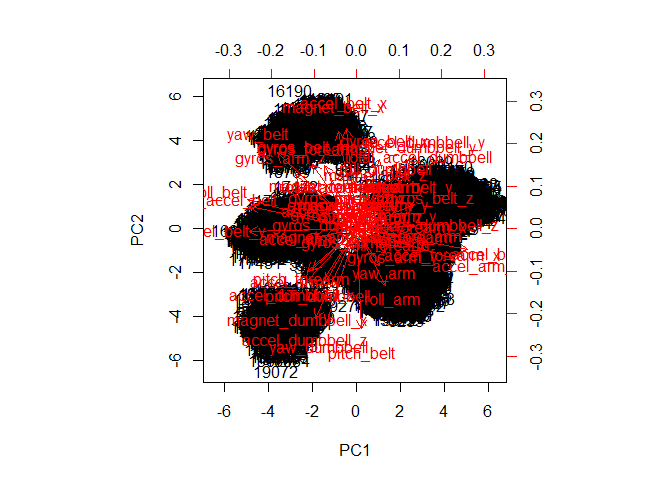
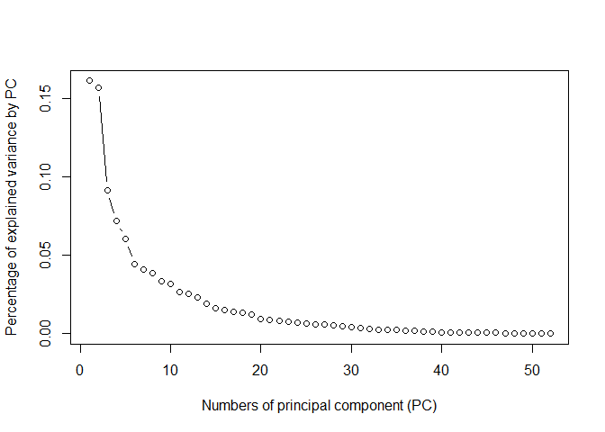

# Practical Machine Learning: Classifying how well an activity was done


### Introduction to the assignment
The task in this assignment is to analyse personal activity data taken by sensors
during a weight lifting exercise in order to predict how well the exercise was
done. To create the data set 6 participants performed barbell lifts correctly 
(class A) and incorrectly with different deviations in movement (classes B-F). 
The data comes from accelerometers on the belt, forearm and arm of all participants
as well as from the dumbbell. Further information can be found here:
http://groupware.les.inf.puc-rio.br/har


### Separation of training data in training and validation data
In this assignment I use random sampling as cross validation, since I want to include
activitiy data of all of the participants in the training set which would not 
necessarily be the case in using k-fold. For each run 75% of the (training) data 
will be used for training, the other 25% will be used for validation. 


### Prepration of the training data
According to the assignment any of the variables of the data set can be used for
the prediction of the classe variable, which contains the information how well the
activity was performed. However, the training data contains several variables which 
contain (almost) no information. In addition the data set
contains administrative columns (number of trial, participant, timestamps,...) which are
not directly connected to the exercise and therefore excluded from learning.
These columns were deleted.


### Selection of the predictors and an adequate model
The predictors as well as the prediction model were chosen using 5 iterations of random sampling for 
cross validation. For feature
extraction I used the principal components analysis (PCA) which showed good separation of the data in
5 clusters.

<!-- --><!-- -->

I also tried PCA only with uncorrelated columns but the result was worse than using all columns, so
I dropped this approach.

Based on the scree plot and the variances explained by the principal components, I used 6 and 18 principal 
components for training the models. 6 components because there was a change in the scree plot around 5 or 6 
principal components (depending on the training set) and 18 components because they explain about 90% of the
variance. According to the scree plot 2 principal components would also be an option, but since they only 
explain about 30% of the variance, I dropped this idea. My analysis showed that (as expected) prediction 
using 18 principal components gave clearly better results than just using 6 components.

### Training the model with the training data set and prediction with validation data
In my analysis I used the methods rpart (recursive partitioning and regression trees) as a simple approach 
and rf (random forest) as a more powerful approach for predicting. For each
method I used 5 iterations using random sampling. Random forest gave steady results with a prediction accuracy of 97%.


### Prediction of testing data
In order to predict how well the activities in the testing set were done, the testing data was prepared
in the same way as the training data:

- the columns not used in the training data were also removed from the testing data

- the principal components analysis from the training data was applied to the testing data and again 18 principal components were used

- the prediction with the rf model defined by the training data was done

With my model, I receive the following predictions for the testing data:

```
##  [1] B A A A A E D B A A B C B A E E A B B B
## Levels: A B C D E
```

The calculation of the accuracy was not possible since the classe variable is not included in
the testing data set. Since the in sample accuracy is about 97% and therefore the in sample
error is about 3% I expect a little higher out of sample error on the testing data.
